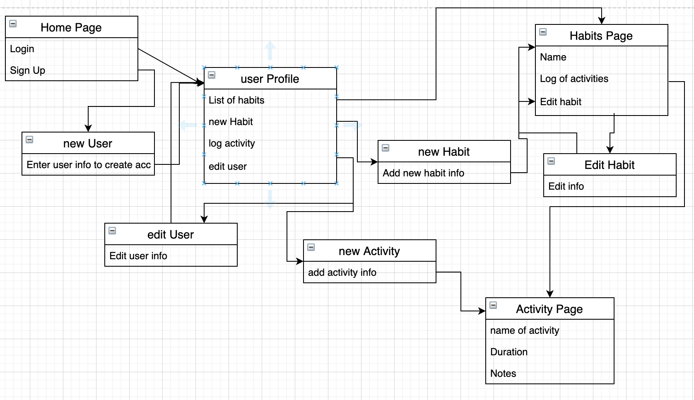

# Project 1 - Stick-2-It - Fabry & Zach

Our idea is a habit tracker app called Stick-2-It. Each user will be able to log in, and set which habits they want to work on. Each habit will have a name and a frequency, whether the user want to work on it once, twice, three times per week, etc. The user will then be able to log each activity/task they did for each habit they are tracking. The activity/task will have a name, duration, and any notes the user wants to add about their activity. 

### Home page

### User Profile

### Habit Index

### Activty info page

### ERD

### Site Map

## User Stories

## Visual Style

We want a minimalist/modern style to our page, with rounded edges, soft limited colors, and sans serif fonts. Below are some visual inspirations for the various parts of our app. 

#### Home Page

[Grayscale Theme for Bootstrap](https://startbootstrap.com/previews/grayscale/)

A simple home page with a large image taking up most/all of the screen. Some nav buttons along the top and a central button prompting the user to login/sign up. The purpose of this page is to look clean and inspiring. 

#### User Profile

[User Profile from Nick Lewis on CodePen](https://codepen.io/nickylew/pen/QpaYLX)

[User Profile from Angela Yun He on CodePen](https://codepen.io/zephyo/pen/maregg)

[UI Design Daily | User Profile](https://uidesigndaily.com/posts/photoshop-user-profile-gallery-day-6)

### Figma Page Mock ups

Fabry put some time into making some mock ups in Figma that refelect what we are looking to do, combining our wireframes and visual inspiration.

#### Blue

#### Brown

## Tools

- [Chart.js | Open source HTML5 Charts for your website](https://www.chartjs.org/)

### Strech Goals

- Social media integration 
  
  - Twitter API 
  
  - FB API 
