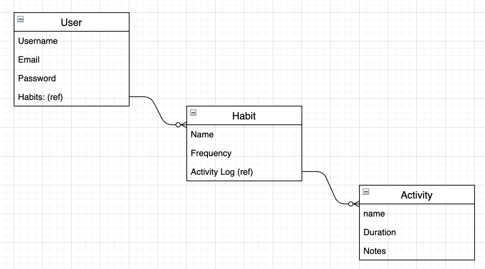

# Project 1 - Habit Tracker - Fabry & Zach

Our idea is a habit tracker app. Each user will be able to log in, and set which habits they want to work on. Each habit will have a name and a frequency, whether the user want to work on it once, twice, three times per week, etc. The user will then be able to log each activity/task they did for each habit they are tracking. The activity/task will have a name, duration, and any notes the user wants to add about their activity. 

### Home page

### User Profile

### ERD

